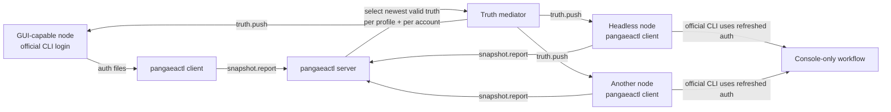

# pangaeactl


`pangaeactl` is a credential synchronization utility for console-first use of LLM coding assistants across multiple machines.

It exists for a practical problem: OAuth login for CLI coding assistants often requires a GUI browser. In mixed environments, operators frequently log in on one GUI-capable node and copy the resulting auth files to headless or console-only nodes. That works only until one node consumes or rotates the refresh token. At that point the other nodes may be left with stale auth state and become unusable.

`pangaeactl` solves that by detecting refreshed auth state on one node and propagating it to the other nodes that should hold the same account, so console-only environments can continue using the official CLI tools.

## Why This Exists

Typical failure pattern:

1. You log in to Claude Code, Codex, or Gemini CLI on a machine with a browser.
2. You copy the generated auth files to one or more remote or headless machines.
3. One node refreshes the token set.
4. The other nodes still hold the old token state and can no longer authenticate correctly.

`pangaeactl` keeps those nodes converged by:

- watching the local auth files
- selecting the newest valid truth per profile and per account
- propagating that truth to the participating nodes
- preserving account boundaries so different human accounts do not get mixed together

## Supported CLI Tools

Current format support:

- Claude Code CLI
- OpenAI Codex CLI
- Gemini CLI

Important behavior:

- `pangaeactl` parses and inspects the auth files for those tools
- it can report redacted auth state, validity, and usage metadata
- it does **not** implement provider-specific OAuth refresh logic as the primary path
- when refresh or recovery is needed, it prefers to trigger the **official CLI tool** and let that tool update its own auth files

Use it only when the participating machines are meant to use the same upstream human account for a given provider.

## How It Works



At a high level:

- clients watch local auth files and report snapshots
- the server selects a valid truth independently for each `(profile, account)` bucket
- only nodes already participating in that same account bucket receive propagation
- receiving clients apply the updated auth files atomically
- periodic and event-driven notifications summarize truth state, propagation, and usage

## Authentication and Topologies

Supported deployment styles:

- direct `client -> server` over `wss://` with `mtls`
- reverse connectivity with `reverse-client` and `reverse-connect`
- SSH-managed reverse connectivity, where the server host SSHes into a remote node and starts `reverse-client`

The default and recommended auth mode is `mtls`.

## Quick Start

Build the binary first. See the build guide:

- [docs/build.md](/workspace/claude-creds-share/docs/build.md:1)

Create server assets:

```bash
./build/linux-amd64/release/pangaeactl setup server --out ./deploy/server
```

Create client assets:

```bash
./build/linux-amd64/release/pangaeactl setup client --out ./deploy/client
```

Run the server:

```bash
pangaeactl serve -c ./deploy/server/pangaea-server.yaml
```

Run a normal client:

```bash
pangaeactl connect -c ./deploy/client/pangaea-client.yaml
```

Run a reverse client on a node that cannot reach the server directly:

```bash
pangaeactl reverse-client -c ./deploy/client/pangaea-client.yaml
```

Run the reverse bridge on the server host:

```bash
pangaeactl reverse-connect -c ./deploy/server/pangaea-server.yaml --socket /tmp/pangaea.sock
```

Inspect a local auth file:

```bash
pangaeactl inspect --format codex-auth-json-format ~/.codex/auth.json
```

Check current server sessions:

```bash
pangaeactl status --socket /tmp/pangaea.sock
```

## What The Project Handles

- mutual TLS server and client setup
- JWT tooling for alternate auth deployments
- per-profile and per-account truth mediation
- atomic file apply with verification and ACK
- direct, reverse, and SSH-managed reverse connectivity
- notifier sinks such as Telegram, Slack, Discord, Mattermost, ntfy, and Teams
- usage probing for supported providers where upstream data is available

## What It Deliberately Does Not Do

- it is not an account provisioning system
- it should not be used to mix different human accounts into one shared bucket
- it does not replace the official provider CLIs
- it does not treat copied OAuth files as a permanent static artifact; convergence is the whole point

## Documentation

- Build guide: [docs/build.md](/workspace/claude-creds-share/docs/build.md:1)
- Deployment guide: [docs/deploy.md](/workspace/claude-creds-share/docs/deploy.md:1)
- Feature overview: [docs/features.md](/workspace/claude-creds-share/docs/features.md:1)
- Claude format notes: [docs/claude.md](/workspace/claude-creds-share/docs/claude.md:1)
- Codex format notes: [docs/codex.md](/workspace/claude-creds-share/docs/codex.md:1)
- Gemini format notes: [docs/gemini.md](/workspace/claude-creds-share/docs/gemini.md:1)

## License

[MIT](./LICENSE)
